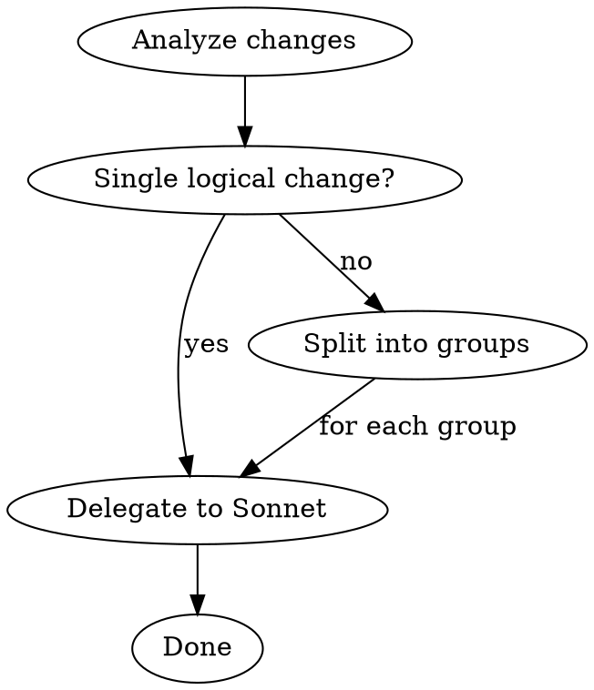

# Atomic Conventional Commits

## Overview

Every commit is **one logical change** with a **conventional commit message**. Mixed changes get split into separate commits. The actual commit work is delegated to a **Sonnet subagent** for efficiency.

## Workflow



### Step 1: Analyze Changes

Run `git status` and `git diff` (staged + unstaged). Classify each changed file/hunk by its logical purpose.

**A logical change is ONE of:**
- A single feature addition (including its docs and tests)
- A single bug fix (including its tests)
- A refactor of one concept
- A standalone test addition
- A standalone documentation update
- A dependency/build change

**Signs you need to split:**
- Changes touch unrelated modules for different reasons
- You can describe the change only with "and" (e.g., "fix auth **and** update styles")
- Test changes test something different from the code changes

### Step 2: Delegate to Sonnet Subagent

For each atomic group, launch an Agent with `model: "sonnet"`:

```
Agent(
  model: "sonnet",
  prompt: "Commit the following changes as an atomic conventional commit. [details below]"
)
```

**What to include in the subagent prompt:**
- The list of files to stage (be explicit — never use `git add .` or `git add -A`)
- A summary of what the changes do and why
- The conventional commit type and scope you determined
- Any project-specific pre-commit instructions from CLAUDE.md (e.g., run deslop, run lint)
- Instruction to use HEREDOC format for the commit message
- Instruction to NEVER skip hooks (--no-verify) or bypass signing

**Subagent commit message format:**
```
type(scope): concise description of why

Optional body with more detail if needed.

Co-Authored-By: Claude <noreply@anthropic.com>
```

**Commit groups sequentially** — never in parallel. Each commit must finish before staging the next group to avoid conflicts.

### Step 3: Verify

After each subagent completes, confirm the commit was created successfully by checking `git log --oneline -1`. If a pre-commit hook fails, fix the issue and retry — never skip hooks.

## Conventional Commits Reference

| Type | When |
|------|------|
| `feat` | New feature or capability |
| `fix` | Bug fix |
| `docs` | Documentation only |
| `style` | Formatting, no logic change |
| `refactor` | Code restructuring, no behavior change |
| `perf` | Performance improvement |
| `test` | Adding or fixing tests |
| `build` | Build system or dependencies |
| `ci` | CI configuration |
| `chore` | Maintenance, tooling |
| `revert` | Reverting a previous commit |

**Scope:** The module, package, or area affected. Use lowercase. Examples: `auth`, `api`, `editor`, `cli`.

**Description rules:**
- Lowercase, no period at end
- Imperative mood ("add" not "added" or "adds")
- Focus on **why**, not **what** (the diff shows what)
- Under 72 characters

## Pre-Commit Checklist

Before delegating to the subagent, check if the project has a CLAUDE.md with commit instructions. Common requirements:
- Run a deslop/cleanup skill before committing
- Run lint or format checks
- Run specific test suites

Include these as instructions in the subagent prompt so they run before the commit.

## Common Mistakes

| Mistake | Fix |
|---------|-----|
| Committing unrelated changes together | Split into atomic groups first |
| Using `git add .` or `git add -A` | Stage specific files by name |
| Vague messages like "update code" | Describe the specific change and why |
| Skipping hooks with `--no-verify` | Never skip — fix the underlying issue |
| Past tense ("added feature") | Use imperative ("add feature") |
| Committing secrets (.env, credentials) | Always review staged files first |
