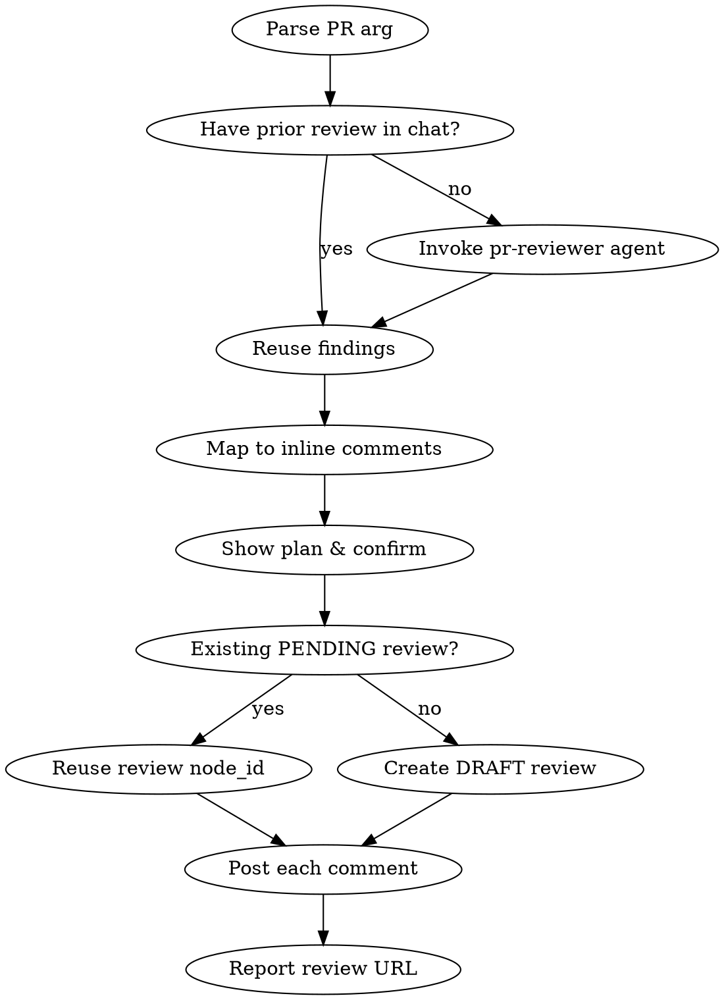

# PR Review → Pending Comments on GitHub

## Overview

Analyze a PR with the `pr-reviewer` agent, convert findings into line-anchored inline comments, and post them as **PENDING** (unsubmitted) review comments on GitHub. The user submits the review themselves when ready — this skill never calls `submitPullRequestReview`.

## Workflow



### Step 1: Resolve the PR

Accept one of:
- Number (`84`)
- URL (`https://github.com/owner/repo/pull/84`)

Resolve `owner/repo`:
- From URL if provided.
- Otherwise from `gh repo view --json nameWithOwner --jq .nameWithOwner`.

Fetch once and cache:
```bash
gh api repos/{owner}/{repo}/pulls/{n} --jq '{node_id, head: .head.sha, user: .user.login}'
```

### Step 2: Obtain the review findings

- If the user has already triggered the `pr-reviewer` agent in this conversation and the output is still relevant, **reuse it** — do not re-run.
- Otherwise invoke the agent:
  ```
  Agent(subagent_type="pr-reviewer", prompt="Review PR #<N> at <URL>. Produce structured findings with file paths and line numbers for each item.")
  ```

Require that each finding includes `path` and either `line` or `startLine`+`line` (the user can refine by hand). Findings that lack a line anchor go into the **review body**, not an inline comment.

### Step 3: Map findings → inline comments

For each finding with a line anchor, build a payload:

| Field | How to derive |
|---|---|
| `path` | file path from the finding |
| `body` | the finding text, formatted in markdown |
| `line` | target line (end of range if multi-line) |
| `side` | `LEFT` for a line that was **deleted**, `RIGHT` for added/modified |
| `startLine` | start of range for multi-line; omit for single-line |
| `startSide` | same rule as `side`; omit for single-line |

**Validate lines against the diff** before posting:
```bash
gh api repos/{owner}/{repo}/pulls/{n}/files --paginate --jq '.[] | {filename, patch}'
```
If a target line is not present in the patch, GitHub rejects with HTTP 422. Fallback: move that comment to the review body or to a nearby line inside the diff with a `(contexto geral)` note.

Findings with no specific line (e.g., "no tests in new package", "nits summary"): aggregate into a single **review body** string to use in Step 5.

### Step 4: Show the plan, confirm

Print a compact table to the user:

```
#  FILE                                        LINE    SIDE   SNIPPET
1  tsconfig.json                               18      LEFT   "**Bloqueador:** Remover `exactOptio..."
2  .npmrc                                      2       RIGHT  "Todo `pnpm install` agora exige..."
...
```

Pause for confirmation unless the user passed `--yes`.

### Step 5: Ensure a PENDING review exists

List reviews and look for a PENDING one owned by the current user:

```bash
ME=$(gh api user --jq .login)
gh api repos/{owner}/{repo}/pulls/{n}/reviews \
  --jq ".[] | select(.state == \"PENDING\" and .user.login == \"$ME\") | .node_id"
```

- **If found**: reuse the `node_id` (GitHub allows only **one** pending review per user per PR).
- **If not**: create a DRAFT review by calling `addPullRequestReview` **without** an `event` field:
  ```bash
  gh api graphql -f query='
    mutation($prId:ID!, $body:String) {
      addPullRequestReview(input:{pullRequestId:$prId, body:$body}) {
        pullRequestReview { id url }
      }
    }' -f prId="<PR_NODE_ID>" -f body="<optional review body>"
  ```
  Omitting `event` leaves the review in PENDING state. Use the aggregated body from Step 3 if there were any findings without line anchors.

### Step 6: Post each comment

For each mapped comment, call `addPullRequestReviewThread`. Two shapes:

**Single-line:**
```bash
gh api graphql -f query='
  mutation($r:ID!,$p:String!,$b:String!,$l:Int!,$s:DiffSide!) {
    addPullRequestReviewThread(input:{
      pullRequestReviewId:$r, path:$p, body:$b, line:$l, side:$s
    }) { thread { id } }
  }' -f r="$REVIEW_ID" -f p="$path" -f b="$body" -F l=$line -f s=$side
```

**Multi-line range:**
```bash
gh api graphql -f query='
  mutation($r:ID!,$p:String!,$b:String!,$l:Int!,$s:DiffSide!,$sl:Int!,$ss:DiffSide!) {
    addPullRequestReviewThread(input:{
      pullRequestReviewId:$r, path:$p, body:$b, line:$l, side:$s,
      startLine:$sl, startSide:$ss
    }) { thread { id } }
  }' -f r="$REVIEW_ID" -f p="$path" -f b="$body" \
     -F l=$line -f s=$side -F sl=$startLine -f ss=$startSide
```

Always pass the body through a `BODY=$(cat <<'EOF' ... EOF)` heredoc to avoid shell interpolation issues with backticks, `$`, and backslashes.

Post **sequentially**, not in parallel — GitHub rate-limits abuse and parallel writes can race.

### Step 7: Report

Print:
- Review URL: `https://github.com/{owner}/{repo}/pull/{n}#pullrequestreview-{id}`
- Count of comments added
- Reminder: **the review is PENDING — not submitted**. The user submits from the GitHub UI (or via a follow-up command) choosing `APPROVE` / `REQUEST_CHANGES` / `COMMENT`.

Do **not** call `submitPullRequestReview` automatically, even if the user previously said "approve". Submitting is an irreversible, visible-to-others action; require explicit follow-up.

## Edge Cases

| Situation | Handling |
|---|---|
| Line not in diff | Fall back to review body, or nearest in-diff line with "(contexto geral)" label. Never force — GitHub returns 422. |
| File deleted in PR | `side: LEFT` is required. Validate before posting. |
| PR rebased mid-review | The pending review persists and auto-rebinds comments to new SHA. No action needed. Warn the user that some comments may end up on stale lines. |
| User lacks review permission (fork from outside org) | `addPullRequestReview` returns an error. Stop and tell the user to open regular PR comments (`gh pr comment`) instead. |
| Existing PENDING review already has comments | Append only. Do not delete or reorder existing comments. |
| `gh` not authenticated | Stop with a message asking the user to run `gh auth login`. |
| PR closed/merged | Still allowed by GitHub, but warn the user the comments may go unseen. |

## Common Mistakes

| Mistake | Fix |
|---|---|
| Using `gh pr review` (creates submitted review, not pending) | Use `addPullRequestReview` GraphQL mutation without `event`. |
| Passing `commit_id` to REST `POST /pulls/{n}/comments` when a PENDING review exists | Triggers HTTP 422 `user_id can only have one pending review`. Use GraphQL `addPullRequestReviewThread` instead. |
| Inlining comment body with shell-unsafe chars (`` ` ``, `$`, `\`) | Always use `BODY=$(cat <<'EOF' ... EOF)` heredoc, then pass as `-f b="$BODY"`. |
| Posting in parallel | Serialize posts. |
| Calling `submitPullRequestReview` | Never in this skill. Only the user submits. |

## Reference: GraphQL IDs

- **PR node_id**: `gh api repos/{owner}/{repo}/pulls/{n} --jq .node_id` (starts with `PR_`)
- **Review node_id**: returned by `addPullRequestReview` or found via `gh api repos/{owner}/{repo}/pulls/{n}/reviews/{id} --jq .node_id` (starts with `PRR_`)
- **Thread ID**: returned by `addPullRequestReviewThread` (starts with `PRRT_`)
